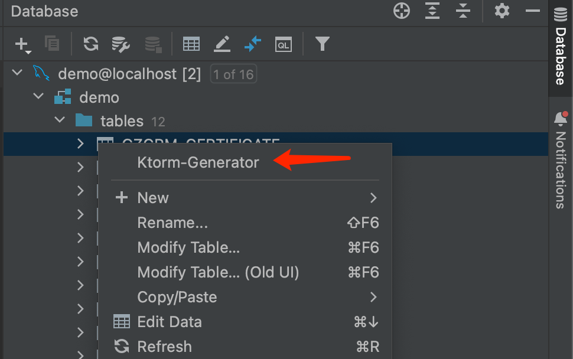
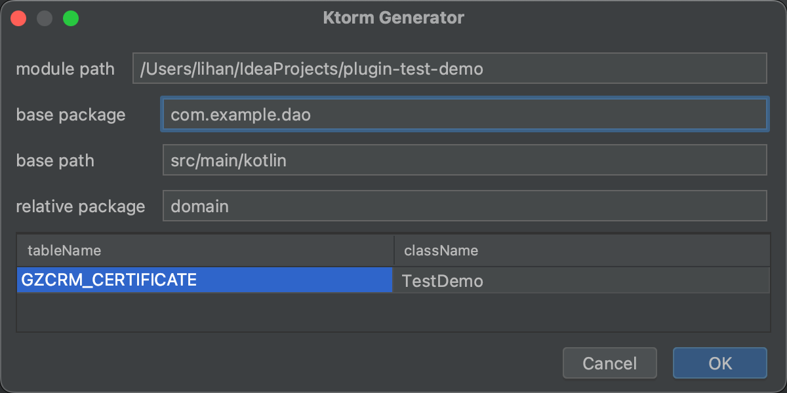

    
    <h1>ktorm-generator</h1>

<!-- Plugin description -->
KtormGenerator is a plugin for generating [Ktorm](https://github.com/kotlin-orm/ktorm) entity class from database table.
<!-- Plugin description end -->

## Installation

- Using the IDE built-in plugin system:
  
  <kbd>Settings/Preferences</kbd> > <kbd>Plugins</kbd> > <kbd>Marketplace</kbd> > <kbd>Search for "ktorm-generator"</kbd> >
  <kbd>Install</kbd>
  
- Manually:

  Download the [latest release](https://github.com/aooohan/ktorm-generator/releases/latest) and install it manually using
  <kbd>Settings/Preferences</kbd> > <kbd>Plugins</kbd> > <kbd>⚙️</kbd> > <kbd>Install plugin from disk...</kbd>

## How to use?
1. Select some tables from Database Tools View, then pop-up menu bar, finally click Ktorm-Generator option.

2. Configure the information needed to generate.(you can also modify the final class name) and click Ok button

---
Plugin based on the [IntelliJ Platform Plugin Template][template].

[template]: https://github.com/JetBrains/intellij-platform-plugin-template
[docs:plugin-description]: https://plugins.jetbrains.com/docs/intellij/plugin-user-experience.html#plugin-description-and-presentation
